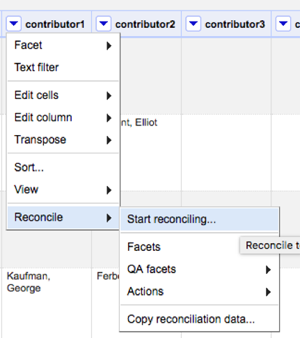
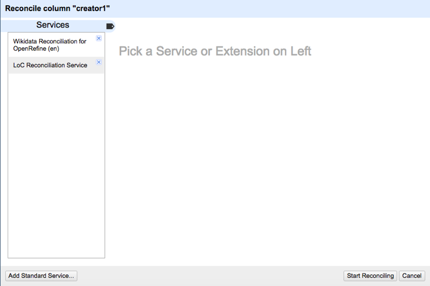
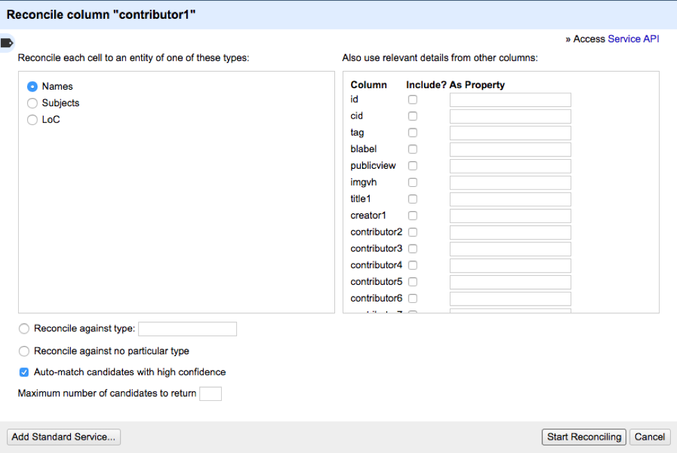
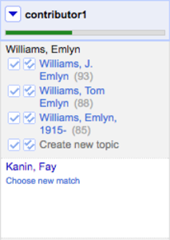
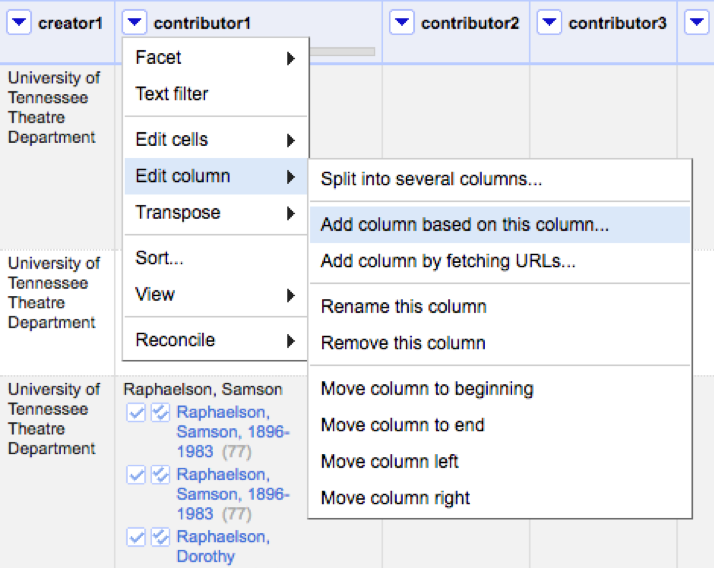
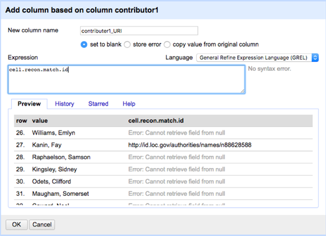

# Reconcilation with the Library of Congress Vocabularies
Note that this uses @cmharlow 's [lcreconcile service](https://github.com/cmharlow/lc-reconcile)

### Installation

1. Go to any column, click on the down arrow, go to “Reconcile” and then click “Start reconciling.”

2. On the next window, click “Add Standard Service” and enter the following URL: https://reconcilelc.herokuapp.com/

3. You should see “LoC Reconciliation Service” appear on the “Services” list. Once this is set up, you will not need to add the service again in the future.

 
### Using Service in OpenRefine

4. Once you’ve completed the actions above you can begin reconciling. To do so, click the arrow on the top of the column that needs this service. Go down to “Reconcile” and then click “Start reconciling…”

 
5. Then select “LoC Reconciliation Service” from the pop-up menu.

6. Select the appropriate radio button (Names, Subjects, or LoC (for both)) and then click “Start Reconciling.” The rest of the instructions will show name reconciliation, but these steps can also be applied to subjects.

After the reconciliation service has run, a green bar will be present at the top of the reconciled column. The results in this column will either have a selected match (e.g. “Kanin, Fay” below) or will prompt you to choose a selection (e.g. “Williams, Emlyn”). The hyperlinked names lead directly to id.loc.gov records so that the authorities can be easily checked.

 

You have the ability to change the reconciliation work if you find false positive matches. If you find that a selected match is not valid, you can click “Choose new match” to remove the automatic link.

7. For those names that offer more than one suggested match, you need to decide upon the best authority. Two columns of check boxes are provided for this purpose. If you want to select an authority for an individual record, click the first box with a single check mark inside. If you would like all of the records associated with a particular name to have the same authority record, click the second box with two check marks

 assign authority for a single record

 assign authority for all records in the project with the same name

One strategy for going through the names is to do a text facet on the column in question. This allows you to go through all the records associated with a name at the same time instead of revisiting the same name several times. In going through the facets you may also identify alternate forms of the same name and decide to reconcile two names to the same controlled term.

8. Once you’ve assigned authorities for all the names that require them, you can automatically generate URIs using the same reconciliation service in another column. To do this click the downward arrow on the name column you just reconciled. Then go to “Edit column” and “Add column based on this column…”

9. In the pop-up menu, give the column a name (originalColumnName_URI) and then enter “cell.recon.match.id” in the “Expression” box. This will automatically pull the URI associated with the name. Make sure when you have removed any facets / selections in the project before adding these values or you will only add URIs for the records you are faceted on. You should see the link appear in the cell.recon.match.id column in the "Preview" tab. Once you've run this expression once, you will be able to reuse it in the future by selecting it under the History tab.

10. Continue to follow this process for all name/subject columns that use controlled LoC terms.
