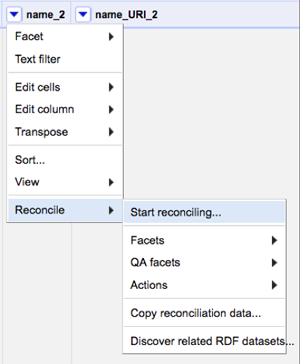
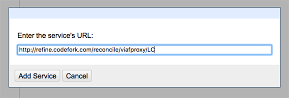
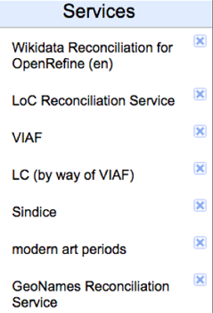
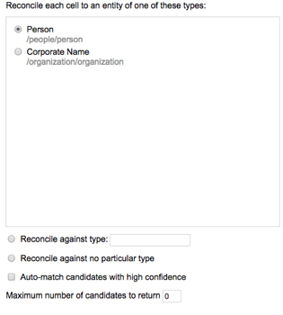
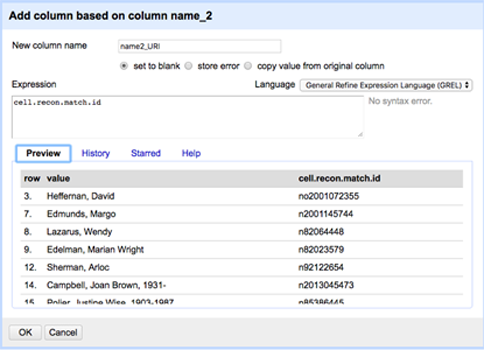
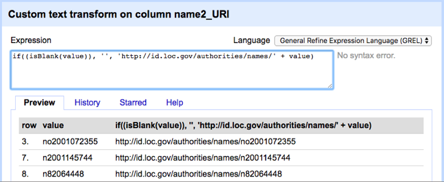

# Reconcilation with the Virtual International Authority File (VIAF)

Provided by http://refine.codefork.com/ OR https://github.com/codeforkjeff/conciliator

Use only for matching with Library of Congress Name Authorities

### Installation Instructions  

1. Add reconciliation service by going to a column and clicking on “Start reconciling” under “Reconcile”
 


2. Next click on “Add Standard Service” in the bottom-left-hand corner.


3. Then enter the following URL http://refine.codefork.com/reconcile/viafproxy/LC in the pop up.



4. After this is complete, you should see “LC (by way of VIAF)” appear in your “Services” list. You only need to add the service once.



### Reconciling
Follow step one above and select “LC (by way of VIAF)” to begin reconciling. Next select either the “Person” or “Corporate Name” radio button. Be sure to uncheck “Auto-match candidates with high confidence” in order to make sure you don’t add authorities that are false positives.



Next click “Start Reconciling” and wait until 100% of the names have been checked. Then proceed to do the authority work of selecting the correct names (see [LoC.md](LoC.md) instructions for more details)

After this is complete, go to Edit column > Add column based on this column. You can then fill in the associated identifier for each reconciled name by inputting `cell.recon.match.id` into the expression box. Also be sure to name the column and indicate it contains a URI. Press “OK.”



Next, you need to make the identifier you added into a functioning URI. Click the arrow on the column you just created and go to Edit cells > Transform. In the expressions box, enter the following:

```if((isBlank(value)), '', 'http://id.loc.gov/authorities/names/' + value)```



Check to make sure the URIs work and that there are no incomplete URIs.
